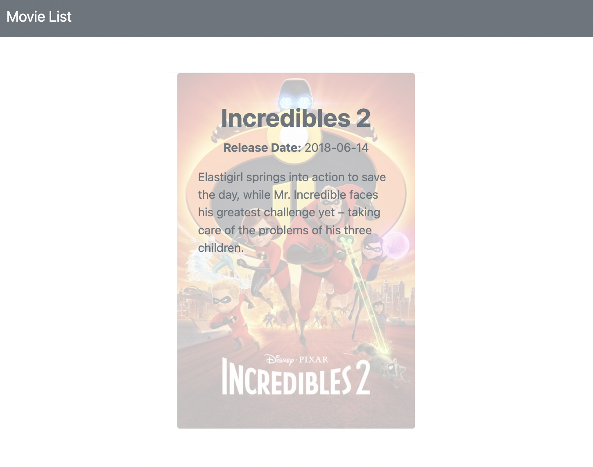
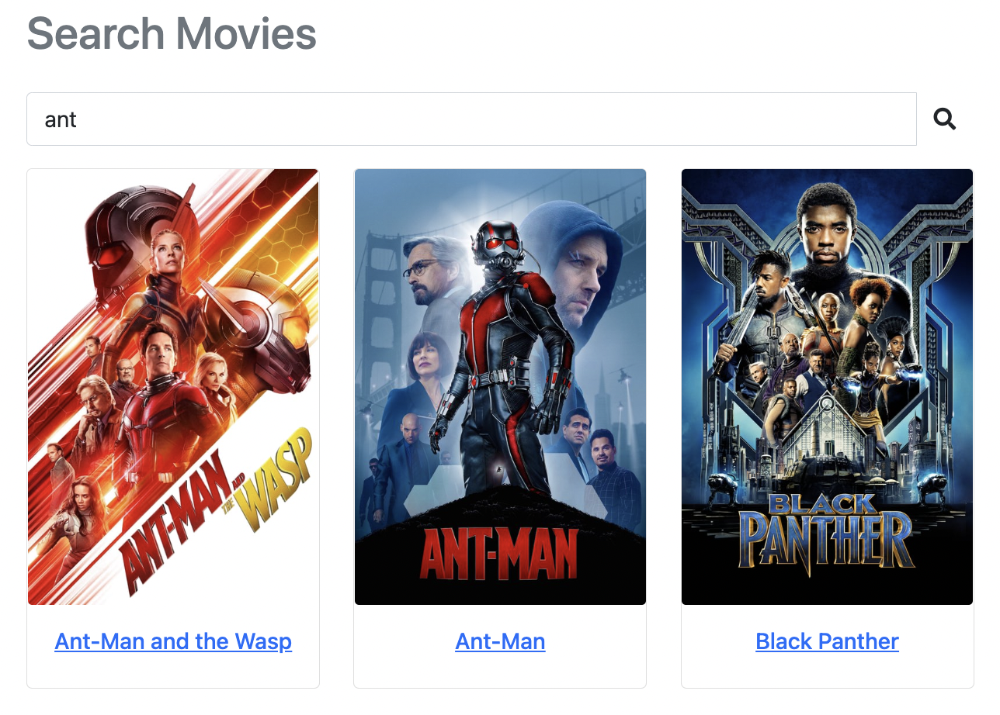

# Movie List

## 📖 Introduction

****

This is a movie list that introduces the best movie ever. Please enjoy it with popcorn & cokes 🍿🥤


## 🎮 Features

Users can overview all movies, including:

- Movie pictures
- Movie names

Users can click the movie and see the detail of each movie, including:

- Movie pictures
- Movie names
- Release date
- Movie description
  


Users can use the search bar to find the keywords of movies, including:

- Movie pictures
- Movie names



Finally, users can use the sort-by to sort the movie list, including:

- A to Z
- Z to A


## 🛠️ Installation

```
# Clone this repository
$ git clone https://github.com/Lilynews/movie-list-010323.git

# Confirmed the terminal is at the project
cd movie-list-010323

# Project setup
$ npm install

# add the file of .env, and set up the DB_URL
MONGODB_URL=mongodb+srv://<account>:<password>@cluster0.<xxxxx>.mongodb.net/<table>?retryWrites=true&w=majority

# Before active project, need to create seeder in DB, type
npm run seed

after setup, type
$ npm run start

# if the message shows like below, please open the web page and type the URL: http://localhost:3000, and you can enter this website.
"App is running on http://localhost:3000"

# To stop the project
ctrl + c
```

## 👩🏻‍💻 Tech/framework used

- VScode 1.73.1
- Express 4.17.1
- Express-handlebars 4.0.2
- bootstrap 5.1.3
- font-awesome

## 🗺️ Roadmap

- [x]  List of movies
    - Details of each movie
        - [x]  Picture, Name
        - [ ]  Genres tags
    - [x]  Search bar
        - Foolproof design
            - [x]  when type space
            - [x]  when a typo cannot be found
        - [x]  Drop-down option by A → Z
        - [x]  Drop-down option by Z → A
        - [ ]  Drop-down option by genres
        - [ ]  Favorite movies list
- [ ]  Favorite movies list
- [ ]  Movie list mode exchange
- [ ]  Peganition
    - [ ]  Movie list
    - [ ]  Favorite movies list
- [ ]  CRUD movie list
- [ ]  Other Front-end optimization